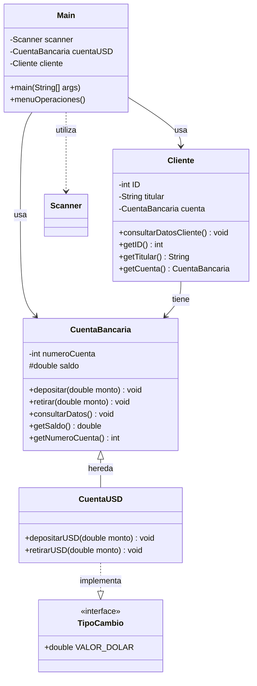

# 💰 Alke Wallet

<div align="center">


**Billetera digital para gestión de activos con soporte multi-moneda**

[Características](#-características) •
[Diagrama de Clases](#-diagrama-de-clases) •
[Instalación](#-instalación) •
[Uso](#-uso) •
[Documentación Técnica](#-documentación-técnica)

</div>

---

## 📋 Descripción

**Alke Wallet** es una aplicación de billetera digital desarrollada en Java que permite a los usuarios gestionar sus activos financieros de manera eficiente. El sistema soporta operaciones en pesos chilenos (CLP) y dólares estadounidenses (USD) con conversión automática de divisas.

### Funcionalidades Principales

- 💵 Depósitos y retiros en **CLP**
- 💲 Depósitos y retiros en **USD** con conversión automática
- 📊 Consulta de saldo en tiempo real
- 👤 Gestión de información del cliente
- 🔄 Conversión de divisas integrada

---

## ✨ Características

- **Multi-moneda**: Soporte para operaciones en CLP y USD
- **Conversión Automática**: Sistema de tipo de cambio integrado
- **Interfaz Intuitiva**: Menú interactivo por consola
- **POO**: Implementación con Programación Orientada a Objetos
- **Herencia**: Arquitectura escalable con herencia de clases
- **Interfaces**: Uso de interfaces para funcionalidades especializadas

---

## 🏗️ Diagrama de Clases



---

## 📦 Instalación

### Prerrequisitos

- **Java JDK 8** o superior
- IDE de tu preferencia (Eclipse, IntelliJ IDEA, NetBeans) o compilador de línea de comandos

### Pasos de Instalación

1. **Clona el repositorio**
   ```bash
   git clone https://github.com/tu-usuario/alke-wallet.git
   cd alke-wallet
   ```

2. **Compila el proyecto**
   ```bash
   javac Main.java
   ```

3. **Ejecuta la aplicación**
   ```bash
   java Main
   ```

---

## 🚀 Uso

### Inicio de Sesión

Al ejecutar la aplicación, se solicitará la siguiente información:

1. **ID del Cliente**: Número de identificación (sin puntos ni guión)
2. **Nombre del Titular**: Nombre completo del usuario
3. **Número de Cuenta**: Identificador único de la cuenta
4. **Saldo Inicial**: Monto inicial en CLP

### Menú de Operaciones

```
╔════════════════════════════════════╗
║        ALKE WALLET - MENÚ          ║
╠════════════════════════════════════╣
║ 1. Depositar en CLP                ║
║ 2. Retirar en CLP                  ║
║ 3. Depositar en USD                ║
║ 4. Retirar en USD                  ║
║ 5. Consultar Saldo                 ║
║ 6. Consultar Datos del Cliente     ║
║ 7. Salir                           ║
╚════════════════════════════════════╝
```

### Ejemplos de Uso

#### Depósito en USD con Conversión

**Escenario:**
- Saldo inicial: 10,000 CLP
- Depósito: 10 USD
- Tipo de cambio: 955 CLP/USD

**Resultado:**
```
Monto convertido: 10 × 955 = 9,550 CLP
Saldo final: 10,000 + 9,550 = 19,550 CLP
```

---

## 📖 Documentación Técnica

### Arquitectura del Sistema

El proyecto utiliza **Programación Orientada a Objetos** con los siguientes pilares:

- **Herencia**: `CuentaUSD` extiende de `CuentaBancaria`
- **Polimorfismo**: Sobrescritura de métodos para operaciones en USD
- **Encapsulamiento**: Uso de modificadores de acceso (`private`, `protected`)
- **Interfaces**: Implementación de `TipoCambio` para conversión de divisas

### Clases Principales

#### 🏦 CuentaBancaria (Superclase)

Clase base que contiene la lógica fundamental de una cuenta bancaria.

**Atributos:**
- `numeroCuenta` (int, private): Identificador único de la cuenta
- `saldo` (double, protected): Balance actual de la cuenta

**Métodos:**
- `depositar(double monto)`: Añade fondos a la cuenta
- `retirar(double monto)`: Sustrae fondos de la cuenta
- `consultarDatos()`: Muestra información de la cuenta

**Nota Técnica:** El atributo `saldo` es de tipo `double` para soportar operaciones con decimales (centavos en USD).

#### 💵 CuentaUSD (Subclase)

Extensión de `CuentaBancaria` que implementa operaciones en dólares estadounidenses.

**Herencia:** `extends CuentaBancaria`  
**Implementa:** `TipoCambio`

**Métodos:**
- `depositarUSD(double monto)`: Convierte USD a CLP y llama a `super.depositar()`
- `retirarUSD(double monto)`: Convierte USD a CLP y llama a `super.retirar()`

**Lógica de Conversión:**
```java
double montoConvertido = monto * VALOR_DOLAR;
super.depositar(montoConvertido);
```

#### 👤 Cliente

Almacena la información del titular de la cuenta.

**Atributos:**
- `ID` (int, private): Identificación del cliente
- `titular` (String, private): Nombre completo del titular
- `cuenta` (CuentaBancaria, private): Referencia a la cuenta bancaria asociada

**Métodos:**
- `consultarDatosCliente()`: Muestra información completa del cliente y su cuenta

**Nota:** La clase `CuentaBancaria` se convierte en un tipo de dato personalizado, permitiendo que un objeto `Cliente` contenga una referencia a su cuenta.

#### 🔄 TipoCambio (Interface)

Define la constante de conversión de divisas.

**Constante:**
- `VALOR_DOLAR` (double): Tipo de cambio USD a CLP (valor fijo: 955)

#### 🖥️ Main (Clase Principal)

Punto de entrada de la aplicación que gestiona la interacción con el usuario.

**Componentes:**
- `Scanner`: Para captura de entrada del usuario
- `menuOperaciones()`: Bucle principal con estructura `switch-case`

**Flujo de Ejecución:**
1. Inicialización de objetos (`CuentaUSD`, `Cliente`)
2. Presentación del menú
3. Procesamiento de opciones mediante `switch-case`
4. Control de flujo con `break` para finalizar cada caso
5. `leer.nextLine()` para pausas entre operaciones

---

## 🔧 Configuración

### Tipo de Cambio

El valor del dólar está definido en la interface `TipoCambio`:

```java
public interface TipoCambio {
    double VALOR_DOLAR = 955.0;
}
```

Para modificar el tipo de cambio, actualiza este valor en la interface.

---

## 🤝 Contribuciones

Las contribuciones son bienvenidas. Por favor, sigue estos pasos:

1. Haz un Fork del proyecto
2. Crea una rama para tu característica (`git checkout -b feature/NuevaCaracteristica`)
3. Realiza tus cambios y haz commit (`git commit -m 'Añadir nueva característica'`)
4. Sube tus cambios (`git push origin feature/NuevaCaracteristica`)
5. Abre un Pull Request

### Guía de Estilo

- Utiliza nombres descriptivos para variables y métodos
- Documenta el código con comentarios JavaDoc
- Sigue las convenciones de nomenclatura de Java (camelCase)
- Mantén los métodos concisos y con una única responsabilidad

---

## 📝 Mejoras Futuras

- [ ] Persistencia de datos (base de datos o archivos)
- [ ] Historial de transacciones
- [ ] Soporte para múltiples monedas
- [ ] Interfaz gráfica (GUI)
- [ ] Sistema de autenticación
- [ ] API REST para integración con otros sistemas
- [ ] Generación de reportes en PDF
- [ ] Notificaciones por email
- [ ] Tipo de cambio dinámico mediante API externa

---

## 📄 Licencia

Este proyecto está licenciado bajo la **Licencia MIT**. Consulta el archivo [LICENSE](LICENSE) para más detalles.

```
MIT License

Copyright (c) 2025 Alke Wallet

Permission is hereby granted, free of charge, to any person obtaining a copy
of this software and associated documentation files (the "Software"), to deal
in the Software without restriction, including without limitation the rights
to use, copy, modify, merge, publish, distribute, sublicense, and/or sell
copies of the Software, and to permit persons to whom the Software is
furnished to do so, subject to the following conditions:

The above copyright notice and this permission notice shall be included in all
copies or substantial portions of the Software.

THE SOFTWARE IS PROVIDED "AS IS", WITHOUT WARRANTY OF ANY KIND, EXPRESS OR
IMPLIED, INCLUDING BUT NOT LIMITED TO THE WARRANTIES OF MERCHANTABILITY,
FITNESS FOR A PARTICULAR PURPOSE AND NONINFRINGEMENT. IN NO EVENT SHALL THE
AUTHORS OR COPYRIGHT HOLDERS BE LIABLE FOR ANY CLAIM, DAMAGES OR OTHER
LIABILITY, WHETHER IN AN ACTION OF CONTRACT, TORT OR OTHERWISE, ARISING FROM,
OUT OF OR IN CONNECTION WITH THE SOFTWARE OR THE USE OR OTHER DEALINGS IN THE
SOFTWARE.
```

---

## 👥 Autores

- **Tu Nombre** - *Desarrollo Inicial* - [@tu-usuario](https://github.com/tu-usuario)

---

## 🙏 Agradecimientos

- A la comunidad de Java por las mejores prácticas
- A los instructores y mentores que apoyaron este proyecto
- A todos los contribuidores que ayudan a mejorar Alke Wallet

---

## 📞 Contacto

¿Tienes preguntas o sugerencias? 

- **Email**: tu-email@ejemplo.com
- **GitHub Issues**: [Reportar un problema](https://github.com/tu-usuario/alke-wallet/issues)
- **LinkedIn**: [Tu Perfil](https://linkedin.com/in/tu-perfil)

---

<div align="center">

**⭐ Si este proyecto te fue útil, considera darle una estrella ⭐**

Hecho con ❤️ y ☕ por [Tu Nombre](https://github.com/tu-usuario)

</div>
