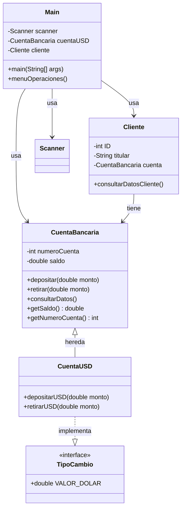

# Diagrama de Clases - Sistema Bancario

## Descripción de las Clases

### Main
- **Responsabilidad**: Clase principal que ejecuta el programa
- **Relaciones**: 
  - Usa Scanner para entrada de datos
  - Crea y utiliza objetos CuentaUSD y Cliente
  - Implementa el menú de operaciones

### CuentaBancaria
- **Atributos**:
  - `numeroCuenta`: Identificador único de la cuenta
  - `saldo`: Balance actual de la cuenta
- **Métodos**:
  - `depositar()`: Agrega fondos a la cuenta
  - `retirar()`: Extrae fondos de la cuenta
  - `consultarDatos()`: Muestra información de la cuenta

### CuentaUSD (hereda de CuentaBancaria)
- **Responsabilidad**: Manejo de cuentas en dólares estadounidenses
- **Métodos**:
  - `depositarUSD()`: Depósito específico para USD
  - `retirarUSD()`: Retiro específico para USD

### Cliente
- **Responsabilidad**: Almacena información del cliente bancario
- **Atributos**:
  - `ID`: Identificador único del cliente
  - `titular`: Nombre del titular de la cuenta
  - `cuenta`: Referencia a la cuenta bancaria del cliente
- **Métodos**:
  - `consultarDatosCliente()`: Muestra información del cliente
- **Relaciones**:
  - Tiene una CuentaBancaria asociada

### TipoCambio (Interface)
- **Responsabilidad**: Define el valor fijo del dólar para conversiones
- **Constante**:
  - `VALOR_DOLAR`: Tipo de cambio fijo USD
- **Implementada por**: CuentaUSD

## Cómo visualizar este diagrama

Este diagrama está escrito en formato **Mermaid**, que es compatible con GitHub. Para verlo:

1. Sube este archivo `.md` a tu repositorio de GitHub
2. GitHub renderizará automáticamente el diagrama
3. También puedes usar extensiones de VSCode como "Markdown Preview Mermaid Support"
4. O visualizarlo en línea en: https://mermaid.live/

## Ejemplo de visualización en README.md

Puedes copiar directamente el código del diagrama en tu `README.md` de GitHub y se mostrará automáticamente.
