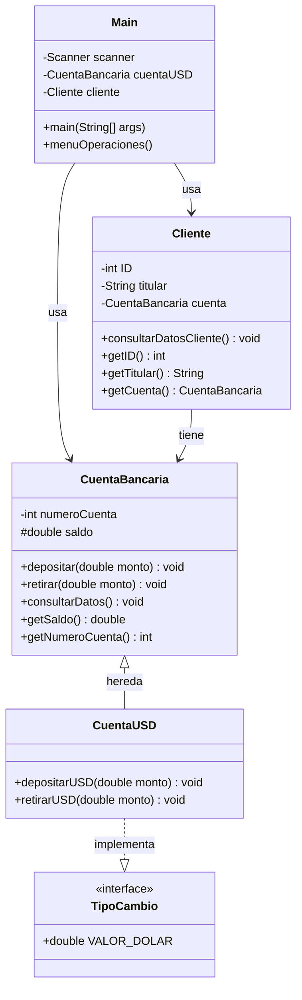

[README.md](https://github.com/user-attachments/files/24998153/README.md)
# 💰 Alke Wallet

<div align="center">


**Billetera digital para gestión de activos con soporte multi-moneda**

[Características](#-características) •
[Diagrama de Clases](#-diagrama-de-clases) •
[Instalación](#-instalación) •
[Uso](#-uso) •
[Documentación Técnica](#-documentación-técnica)

</div>

---

## 📋 Descripción

**Alke Wallet** es una aplicación de billetera digital desarrollada en Java que permite a los usuarios gestionar sus activos financieros de manera eficiente. El sistema soporta operaciones en pesos chilenos (CLP) y dólares estadounidenses (USD) con conversión automática de divisas.

### Funcionalidades Principales

- 💵 Depósitos y retiros en **CLP**
- 💲 Depósitos y retiros en **USD** con conversión automática
- 📊 Consulta de saldo en tiempo real
- 👤 Gestión de información del cliente
  

---

## ✨ Características

- **Conversión Automática**: Sistema de tipo de cambio integrado
- **POO**: Implementación con Programación Orientada a Objetos
- **Herencia**: Arquitectura escalable con herencia de clases
- **Interfaces**: Uso de interfaces para funcionalidades especializadas

---

## 🏗️ Diagrama de Clases



---

## 📦 Instalación

### Prerrequisitos

- **Java JDK 8** o superior
- IDE de tu preferencia (Eclipse, IntelliJ IDEA, NetBeans) o compilador de línea de comandos

### Pasos de Instalación

1. **Clona el repositorio**
   ```bash
   git clone https://github.com/tu-usuario/alke-wallet.git
   cd alke-wallet
   ```

2. **Compila el proyecto**
   ```bash
   javac Main.java
   ```

3. **Ejecuta la aplicación**
   ```bash
   java Main
   ```

---

## 🚀 Uso

### Inicio de Sesión

Al ejecutar la aplicación, se solicitará la siguiente información:

1. **ID del Cliente**: Número de identificación (sin puntos ni guión)
2. **Nombre del Titular**: Nombre completo del usuario
3. **Número de Cuenta**: Identificador único de la cuenta
4. **Saldo Inicial**: Monto inicial en CLP

### Menú de Operaciones

```
╔════════════════════════════════════╗
║        ALKE WALLET - MENÚ          ║
╠════════════════════════════════════╣
║ 1. Depositar en CLP                ║
║ 2. Retirar en CLP                  ║
║ 3. Depositar en USD                ║
║ 4. Retirar en USD                  ║
║ 5. Consultar Saldo                 ║
║ 6. Consultar Datos del Cliente     ║
║ 7. Cerra seción                    ║
╚════════════════════════════════════╝
```

### Ejemplos de Uso

#### Depósito en USD con Conversión

**Escenario:**
- Saldo inicial: 10,000 CLP
- Depósito: 10 USD
- Tipo de cambio: 873.36 CLP/USD

**Resultado:**
```
Monto convertido: 10 × 873.36 = 8,733.6 CLP
Saldo final: 10,000 + 8,733.6 = 18,733.6 CLP
```

---

## 📖 Documentación Técnica

### Arquitectura del Sistema

El proyecto utiliza **Programación Orientada a Objetos** con los siguientes pilares:

- **Herencia**: `CuentaUSD` extiende de `CuentaBancaria`
- **Polimorfismo**: Sobrescritura de métodos para operaciones en USD
- **Encapsulamiento**: Uso de modificadores de acceso (`private`, `protected`)
- **Interfaces**: Implementación de `TipoCambio` para conversión de divisas

### Clases Principales

#### 🏦 CuentaBancaria (Superclase)

Clase base que contiene la lógica fundamental de una cuenta bancaria.

**Atributos:**
- `numeroCuenta` (int, private): Identificador único de la cuenta
- `saldo` (double, protected): Balance actual de la cuenta

**Métodos:**
- `depositar(double monto)`: Añade fondos a la cuenta
- `retirar(double monto)`: Sustrae fondos de la cuenta
- `consultarDatos()`: Muestra información de la cuenta

**Nota Técnica:** El atributo `saldo` es de tipo `double` para soportar operaciones con decimales (centavos en USD).

#### 💵 CuentaUSD (Subclase)

Extensión de `CuentaBancaria` que implementa operaciones en dólares estadounidenses.

**Herencia:** `extends CuentaBancaria`  
**Implementa:** `TipoCambio`

**Métodos:**
- `depositarUSD(double monto)`: Convierte USD a CLP y llama a `super.depositar()`
- `retirarUSD(double monto)`: Convierte USD a CLP y llama a `super.retirar()`

**Lógica de Conversión:**
```java
double montoConvertido = monto * VALOR_DOLAR;
super.depositar(montoConvertido);
```

#### 👤 Cliente

Almacena la información del titular de la cuenta.

**Atributos:**
- `ID` (int, private): Identificación del cliente
- `titular` (String, private): Nombre completo del titular
- `cuenta` (CuentaBancaria, private): Referencia a la cuenta bancaria asociada

**Métodos:**
- `consultarDatosCliente()`: Muestra información completa del cliente y su cuenta

**Nota:** La clase `CuentaBancaria` se convierte en un tipo de dato personalizado, permitiendo que un objeto `Cliente` contenga una referencia a su cuenta.

#### 🔄 TipoCambio (Interface)

Define la constante de conversión de divisas.

**Constante:**
- `VALOR_DOLAR` (double): Tipo de cambio USD a CLP (valor fijo: 873.36)

#### 🖥️ Main (Clase Principal)

Punto de entrada de la aplicación que gestiona la interacción con el usuario.

**Componentes:**
- `Scanner`: Para captura de entrada del usuario
- `menuOperaciones()`: Bucle principal con estructura `switch-case`

**Flujo de Ejecución:**
1. Inicialización de objetos (`CuentaUSD`, `Cliente`)
2. Presentación del menú
3. Procesamiento de opciones mediante `switch-case`
4. Control de flujo con `break` para finalizar cada caso
5. `leer.nextLine()` para pausas entre operaciones

---

## 🔧 Configuración

### Tipo de Cambio

El valor del dólar está definido en la interface `TipoCambio`:

```java
public interface TipoCambio {
    double VALOR_DOLAR = 873.36;
}
```

Para modificar el tipo de cambio, actualiza este valor en la interface.
```
```
---
## 📄 Pruebas unitarias

En este proyecto se realizaron pruebas unitarias a los métodos depositar y retirar de las clases CuentaBancaria y CuentaUSD.
Como saldo inicial se indicó un valor de 1000.0 CLP.

Clase CuentaBancaria

- Método depositoCorrecto: se depositan 1000.0 CLP, nuevo saldo cuenta 2000.0 CLP.
- Método depositoIncorrecto: se depositan 1000.0 CLP, saldo cuenta se mantiene.
- Método retiroCorrecto: se retiran 500.0 CLP, nuevo saldo cuenta 500.0 CLP-
- Método retiroIncorrecto: se retiran 500.0 CLP, saldo cuenta se mantiene.

Clase CuentaUSD

- Método depositoUsdCorrecto: se depositan 10 USD, se realiza conversión a CLP, nuevo saldo cuenta 9733.5 CLP.
- Método depositoUsdIncorrecto: se depositan 10 USD, saldo cuenta se mantiene en 1000.0 CLP.
- Método retiroUsdCorrecto: se depositan 10 USD para evitar saldo insuficiente, se retiran 10 USD, se realiza conversión a CLP, nuevo saldo cuenta 1000.0 CLP.
- Método retiroUsdIncorrecto: se retiran 10 USD, saldo es insuficiente por lo que la operación no se realiza, saldo cuenta se mantiene en 1000.0 CLP.
```
```
---

## Referencias

Recursos y referencias que facilitaron la resolución y mejorar de la calidad del proyecto:

1. JUnit.
2. GitHub.
3. Eclipse IDE.
```
```
---

### Backlog de tareas.

- Crear Superclase CuentaBancaria con métodos para depositar y retirar monto en CLP de la wallet.
- Crear Subclase CuentaUSD con métodos de sobreescritura para gestionar depósitos y retiros en USD.
- Crear interface que especifique el valor del cambio de divisas.
- Crear clase Cliente que maneje los datos del usuario de la wallet.
- Crear Clase principal Main que permita la interacción del usuario con la wallet.
```
```
---

## 📝 Recursos

- Apoyo externo: Para el apoyo de este trabajo se revisaron perfiles y repositorios públicos de Github con el fin de comprender enfoques, estructuras y buenas prácticas de programación. Algunos son: 
    www.github.com/Mariocanedo
      
- Uso de recursos educativos: Para comprender el uso de GitHub se consultaron tutoriales educativos disponibles en YouTube:
    https://www.youtube.com/watch?v=P0lr6ldSQe4
  
- Declaración de uso de Inteligencia Artificial: En la elaboración de este trabajo se utilizó inteligencia artificial como herramienta de apoyo, principalmente para comprender conceptos, resolver dudas técnicas y analizar posibles soluciones. El código final fue analizado, modificado y validado por la persona autora, asegurando el correcto funcionamiento, originalidad y el cumplimiento de principios éticos. Se hizo uso de:
      Claude
      OpenIA
 ``` 

```

---

## 👥 Autores

- **Denisse Ibacache**  - [(https://github.com/DeniBeatriz)

---

## 🙏 Agradecimientos

- A los compañeros del grupo G1 que estuvieron dispuestos a resolver dudas sobre código así como uso de las herramientas.

---


