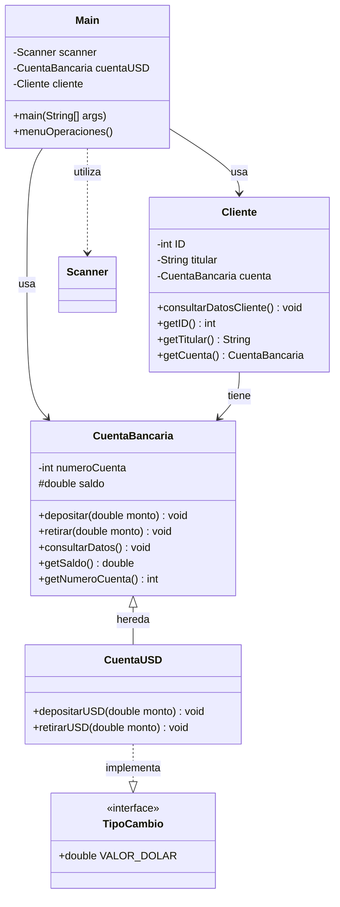

[README.md.md](https://github.com/user-attachments/files/24998127/README.md.md)
# 💰 Alke Wallet - Documentación Técnica Completa

## 📖 Índice

1. [Descripción del Proyecto](#descripción-del-proyecto)
2. [Diagrama de Clases](#diagrama-de-clases)
3. [Superclase CuentaBancaria](#superclase-cuentabancaria)
4. [Subclase CuentaUSD](#subclase-cuentausd)
5. [Interface TipoCambio](#interface-tipocambio)
6. [Clase Cliente](#clase-cliente)
7. [Clase Principal (Main)](#clase-principal-main)
8. [Ejemplos de Conversión](#ejemplos-de-conversión)

---

## Descripción del Proyecto

**Alke Wallet** es un proyecto que consiste en realizar una billetera digital para que los usuarios puedan gestionar sus activos. El programa permite depositar/retirar y consultar saldo en CLP (Pesos Chilenos), así como depositar/retirar en dólares (USD), transformando automáticamente a CLP y modificando el saldo de la cuenta.

### Funcionalidades Principales

- 💵 Depósito en **CLP**
- 💵 Retiro en **CLP**
- 💲 Depósito en **USD** (con conversión automática a CLP)
- 💲 Retiro en **USD** (con conversión automática a CLP)
- 📊 Consulta de saldo
- 👤 Consulta de datos del cliente

---
[README (1).md](https://github.com/user-attachments/files/24998131/README.1.md)# 💰 Alke Wallet

<div align="center">


**Billetera digital para gestión de activos con soporte multi-moneda**

[Características](#-características) •
[Diagrama de Clases](#-diagrama-de-clases) •
[Instalación](#-instalación) •
[Uso](#-uso) •
[Documentación Técnica](#-documentación-técnica)

</div>


---

## 🏗️ Diagrama de Clases



---

## 📦 Instalación

### Prerrequisitos

- **Java JDK 8** o superior
- IDE de tu preferencia (Eclipse, IntelliJ IDEA, NetBeans) o compilador de línea de comandos

### Pasos de Instalación

1. **Clona el repositorio**
   ```bash
   git clone https://github.com/tu-usuario/alke-wallet.git
   cd alke-wallet
   ```

2. **Compila el proyecto**
   ```bash
   javac Main.java
   ```

3. **Ejecuta la aplicación**
   ```bash
   java Main
   ```

---

## 🚀 Uso

### Inicio de Sesión

Al ejecutar la aplicación, se solicitará la siguiente información:

1. **ID del Cliente**: Número de identificación (sin puntos ni guión)
2. **Nombre del Titular**: Nombre completo del usuario
3. **Número de Cuenta**: Identificador único de la cuenta
4. **Saldo Inicial**: Monto inicial en CLP

### Menú de Operaciones

```
╔════════════════════════════════════╗
║        ALKE WALLET - MENÚ          ║
╠════════════════════════════════════╣
║ 1. Depositar en CLP                ║
║ 2. Retirar en CLP                  ║
║ 3. Depositar en USD                ║
║ 4. Retirar en USD                  ║
║ 5. Consultar Saldo                 ║
║ 6. Consultar Datos del Cliente     ║
║ 7. Salir                           ║
╚════════════════════════════════════╝
```

### Ejemplos de Uso

#### Depósito en USD con Conversión

**Escenario:**
- Saldo inicial: 10,000 CLP
- Depósito: 10 USD
- Tipo de cambio: 955 CLP/USD

**Resultado:**
```
Monto convertido: 10 × 955 = 9,550 CLP
Saldo final: 10,000 + 9,550 = 19,550 CLP
```

---

## 📖 Documentación Técnica

### Arquitectura del Sistema

El proyecto utiliza **Programación Orientada a Objetos** con los siguientes pilares:

- **Herencia**: `CuentaUSD` extiende de `CuentaBancaria`
- **Polimorfismo**: Sobrescritura de métodos para operaciones en USD
- **Encapsulamiento**: Uso de modificadores de acceso (`private`, `protected`)
- **Interfaces**: Implementación de `TipoCambio` para conversión de divisas

### Clases Principales

#### 🏦 CuentaBancaria (Superclase)

Clase base que contiene la lógica fundamental de una cuenta bancaria.

**Atributos:**
- `numeroCuenta` (int, private): Identificador único de la cuenta
- `saldo` (double, protected): Balance actual de la cuenta

**Métodos:**
- `depositar(double monto)`: Añade fondos a la cuenta
- `retirar(double monto)`: Sustrae fondos de la cuenta
- `consultarDatos()`: Muestra información de la cuenta

**Nota Técnica:** El atributo `saldo` es de tipo `double` para soportar operaciones con decimales (centavos en USD).

#### 💵 CuentaUSD (Subclase)

Extensión de `CuentaBancaria` que implementa operaciones en dólares estadounidenses.

**Herencia:** `extends CuentaBancaria`  
**Implementa:** `TipoCambio`

**Métodos:**
- `depositarUSD(double monto)`: Convierte USD a CLP y llama a `super.depositar()`
- `retirarUSD(double monto)`: Convierte USD a CLP y llama a `super.retirar()`

**Lógica de Conversión:**
```java
double montoConvertido = monto * VALOR_DOLAR;
super.depositar(montoConvertido);
```

#### 👤 Cliente

Almacena la información del titular de la cuenta.

**Atributos:**
- `ID` (int, private): Identificación del cliente
- `titular` (String, private): Nombre completo del titular
- `cuenta` (CuentaBancaria, private): Referencia a la cuenta bancaria asociada

**Métodos:**
- `consultarDatosCliente()`: Muestra información completa del cliente y su cuenta

**Nota:** La clase `CuentaBancaria` se convierte en un tipo de dato personalizado, permitiendo que un objeto `Cliente` contenga una referencia a su cuenta.

#### 🔄 TipoCambio (Interface)

Define la constante de conversión de divisas.

**Constante:**
- `VALOR_DOLAR` (double): Tipo de cambio USD a CLP (valor fijo: 955)

#### 🖥️ Main (Clase Principal)

Punto de entrada de la aplicación que gestiona la interacción con el usuario.

**Componentes:**
- `Scanner`: Para captura de entrada del usuario
- `menuOperaciones()`: Bucle principal con estructura `switch-case`

**Flujo de Ejecución:**
1. Inicialización de objetos (`CuentaUSD`, `Cliente`)
2. Presentación del menú
3. Procesamiento de opciones mediante `switch-case`
4. Control de flujo con `break` para finalizar cada caso
5. `leer.nextLine()` para pausas entre operaciones

---

## 🔧 Configuración

### Tipo de Cambio

El valor del dólar está definido en la interface `TipoCambio`:

```java
public interface TipoCambio {
    double VALOR_DOLAR = 955.0;
}
```

Para modificar el tipo de cambio, actualiza este valor en la interface.

---

## 🤝 Contribuciones

Las contribuciones son bienvenidas. Por favor, sigue estos pasos:

1. Haz un Fork del proyecto
2. Crea una rama para tu característica (`git checkout -b feature/NuevaCaracteristica`)
3. Realiza tus cambios y haz commit (`git commit -m 'Añadir nueva característica'`)
4. Sube tus cambios (`git push origin feature/NuevaCaracteristica`)
5. Abre un Pull Request

### Guía de Estilo

- Utiliza nombres descriptivos para variables y métodos
- Documenta el código con comentarios JavaDoc
- Sigue las convenciones de nomenclatura de Java (camelCase)
- Mantén los métodos concisos y con una única responsabilidad

---

## 📝 Mejoras Futuras

- [ ] Persistencia de datos (base de datos o archivos)
- [ ] Historial de transacciones
- [ ] Soporte para múltiples monedas
- [ ] Interfaz gráfica (GUI)
- [ ] Sistema de autenticación
- [ ] API REST para integración con otros sistemas
- [ ] Generación de reportes en PDF
- [ ] Notificaciones por email
- [ ] Tipo de cambio dinámico mediante API externa

---

## 📄 Licencia

Este proyecto está licenciado bajo la **Licencia MIT**. Consulta el archivo [LICENSE](LICENSE) para más detalles.

```
MIT License

Copyright (c) 2025 Alke Wallet

Permission is hereby granted, free of charge, to any person obtaining a copy
of this software and associated documentation files (the "Software"), to deal
in the Software without restriction, including without limitation the rights
to use, copy, modify, merge, publish, distribute, sublicense, and/or sell
copies of the Software, and to permit persons to whom the Software is
furnished to do so, subject to the following conditions:

The above copyright notice and this permission notice shall be included in all
copies or substantial portions of the Software.

THE SOFTWARE IS PROVIDED "AS IS", WITHOUT WARRANTY OF ANY KIND, EXPRESS OR
IMPLIED, INCLUDING BUT NOT LIMITED TO THE WARRANTIES OF MERCHANTABILITY,
FITNESS FOR A PARTICULAR PURPOSE AND NONINFRINGEMENT. IN NO EVENT SHALL THE
AUTHORS OR COPYRIGHT HOLDERS BE LIABLE FOR ANY CLAIM, DAMAGES OR OTHER
LIABILITY, WHETHER IN AN ACTION OF CONTRACT, TORT OR OTHERWISE, ARISING FROM,
OUT OF OR IN CONNECTION WITH THE SOFTWARE OR THE USE OR OTHER DEALINGS IN THE
SOFTWARE.
```

---

## 👥 Autores

- **Tu Nombre** - *Desarrollo Inicial* - [@tu-usuario](https://github.com/tu-usuario)

---

## 🙏 Agradecimientos

- A la comunidad de Java por las mejores prácticas
- A los instructores y mentores que apoyaron este proyecto
- A todos los contribuidores que ayudan a mejorar Alke Wallet

---

## 📞 Contacto

¿Tienes preguntas o sugerencias? 

- **Email**: tu-email@ejemplo.com
- **GitHub Issues**: [Reportar un problema](https://github.com/tu-usuario/alke-wallet/issues)
- **LinkedIn**: [Tu Perfil](https://linkedin.com/in/tu-perfil)

---

<div align="center">

**⭐ Si este proyecto te fue útil, considera darle una estrella ⭐**

Hecho con ❤️ y ☕ por [Tu Nombre](https://github.com/tu-usuario)

</div>


## Diagrama de Clases

### Diagrama UML del Proyecto Alke Wallet


---

## Superclase CuentaBancaria

### Descripción

La Superclase **CuentaBancaria** es la clase base del sistema, de la cual heredan sus atributos y métodos las clases derivadas. En el proyecto Alke Wallet, hereda los atributos `numeroCuenta` y `saldo`, junto con los métodos `depositar` y `retirar`. Esta información es requerida al usar la cuenta con cambio de divisas, específicamente para el cambio de USD a CLP.

### Atributos de la Superclase CuentaBancaria

#### 1. numeroCuenta

```java
private int numeroCuenta;
```

- **Modificador de acceso**: `private`
- **Acceso**: Se accede mediante métodos Getter y Setter
- **Tipo de dato**: `int` (número entero)
- **Descripción**: Identificador único de la cuenta bancaria

**Nota técnica**: El modificador `private` se utiliza para proteger el número de cuenta y evitar acceso directo desde otras clases. El acceso controlado mediante Getter y Setter permite validar y controlar las modificaciones.

#### 2. saldo

```java
protected double saldo;
```

- **Modificador de acceso**: `protected`
- **Acceso**: Permite a las subclases acceder directamente al saldo
- **Tipo de dato**: `double` (número decimal)
- **Descripción**: Balance actual de la cuenta

**Razón del tipo double**: Al ofrecer la opción de depositar/retirar en dólares (USD), el dato debe ser `double` para aceptar valores decimales, en caso de que el depósito o retiro incluya los centavos.

**Razón del modificador protected**: Permite que la subclase `CuentaUSD` acceda directamente al saldo para realizar operaciones de conversión sin necesidad de métodos adicionales.

### Métodos de la Superclase CuentaBancaria

Se establecen los métodos para depositar/retirar saldo y consultar el saldo de la cuenta.

#### Método depositar en CLP

```java
public void depositar(double monto) {
    if (monto > 0) {
        saldo += monto;
        System.out.println("Depósito exitoso. Nuevo saldo: " + saldo + " CLP");
    } else {
        System.out.println("El monto debe ser mayor a 0");
    }
}
```

**Funcionalidad**: 
- Recibe un monto en pesos chilenos (CLP)
- Valida que el monto sea positivo
- Incrementa el saldo de la cuenta
- Muestra confirmación de la operación

#### Método retirar en CLP

```java
public void retirar(double monto) {
    if (monto > 0 && monto <= saldo) {
        saldo -= monto;
        System.out.println("Retiro exitoso. Nuevo saldo: " + saldo + " CLP");
    } else if (monto > saldo) {
        System.out.println("Fondos insuficientes");
    } else {
        System.out.println("El monto debe ser mayor a 0");
    }
}
```

**Funcionalidad**:
- Recibe un monto a retirar en CLP
- Valida que el monto sea positivo
- Verifica que haya fondos suficientes
- Decrementa el saldo de la cuenta
- Muestra confirmación o mensaje de error

#### Método consultar saldo

```java
public void consultarDatos() {
    System.out.println("Número de cuenta: " + numeroCuenta);
    System.out.println("Saldo disponible: " + saldo + " CLP");
}
```

**Funcionalidad**: Este método devuelve el valor actual en CLP en la cuenta, mostrando el número de cuenta y el saldo disponible.

---

## Subclase CuentaUSD

### Descripción

La clase **CuentaUSD** es una subclase de la clase `CuentaBancaria` e implementa la interface `TipoCambio`. La herencia se declara a través del término `extends` y la interface a través del término `implements`.

```java
public class CuentaUSD extends CuentaBancaria implements TipoCambio {
    // Implementación
}
```

### Características

- **No posee atributos propios**: Solo modifica los métodos (depositar/retirar) implementados en la clase padre `CuentaBancaria`.
- **Función principal**: Gestionar operaciones en dólares estadounidenses con conversión automática a CLP.

### Lógica de Conversión

La subclase recibe el monto ingresado por el usuario como dólares. Si se sumara o restara directamente este monto al saldo de la cuenta, se generaría un error de cálculo. Sin embargo, al utilizar la interface `TipoCambio`, el sistema puede convertir el monto de USD a CLP previo a realizar la operación.

### Métodos de CuentaUSD

#### Método depositarUSD

```java
public void depositarUSD(double monto) {
    double montoConvertido = monto * VALOR_DOLAR;
    super.depositar(montoConvertido);
    System.out.println("Depósito de " + monto + " USD convertidos a " + montoConvertido + " CLP");
}
```

**Funcionamiento**:
1. Recibe el monto en dólares (USD)
2. Multiplica el monto por el valor del dólar (constante `VALOR_DOLAR`)
3. Llama al método `depositar()` de la clase padre mediante `super.depositar()`
4. Realiza la operación con el monto convertido a CLP

#### Método retirarUSD

```java
public void retirarUSD(double monto) {
    double montoConvertido = monto * VALOR_DOLAR;
    super.retirar(montoConvertido);
    System.out.println("Retiro de " + monto + " USD convertidos a " + montoConvertido + " CLP");
}
```

**Funcionamiento**:
1. Recibe el monto en dólares (USD)
2. Multiplica el monto por el valor del dólar (constante `VALOR_DOLAR`)
3. Llama al método `retirar()` de la clase padre mediante `super.retirar()`
4. Realiza la operación con el monto convertido a CLP

### Uso de super

Se llama al método establecido en la clase padre `CuentaBancaria` a través de `super.` para realizar la operación con el monto ya convertido de USD a CLP al multiplicar el monto por el valor del dólar.

---

## Interface TipoCambio

### Descripción

La interface **TipoCambio** establece el valor del dólar por el cual se realiza la conversión de USD a CLP.

```java
public interface TipoCambio {
    double VALOR_DOLAR = 955.0;
}
```

### Características

- **Constante fija**: `VALOR_DOLAR = 955.0`
- **Tipo de dato**: `double` (permite valores decimales para tipos de cambio más precisos)
- **Uso**: Implementada por la clase `CuentaUSD` para acceder al valor de conversión

### Propósito

Esta interface proporciona un valor constante y centralizado del tipo de cambio, permitiendo:
- Consistencia en todas las operaciones de conversión
- Facilidad de actualización (se modifica en un solo lugar)
- Cumplimiento del principio de diseño "Single Source of Truth"

---

## Clase Cliente

### Descripción

La clase **Cliente** reúne los datos del titular de la cuenta. En el presente proyecto se utiliza con la finalidad de dar un mayor orden al menú establecido en la clase Principal `Main`, separando la lógica de datos del cliente de la lógica de operaciones bancarias.

### Atributos de la Clase Cliente

#### 1. ID

```java
private int ID;
```

- **Modificador de acceso**: `private`
- **Acceso**: Se accede mediante Getter y Setter
- **Tipo de dato**: `int` (número entero)
- **Descripción**: Número de identificación del cliente

**Uso**: Se solicita al usuario que ingrese su número de identificación sin puntos ni guión, obteniendo así un número entero único que identifica al cliente.

#### 2. titular

```java
private String titular;
```

- **Modificador de acceso**: `private`
- **Acceso**: Se accede mediante Getter y Setter
- **Tipo de dato**: `String` (cadena de texto)
- **Descripción**: Nombre completo del titular de la cuenta

**Uso**: Se recibe un texto con el nombre del usuario. El código está configurado para manejar correctamente los espacios escritos por el usuario, permitiendo nombres compuestos.

#### 3. cuenta

```java
private CuentaBancaria cuenta;
```

- **Modificador de acceso**: `private`
- **Acceso**: Se accede mediante Getter y Setter
- **Tipo de dato**: `CuentaBancaria` (tipo personalizado)
- **Descripción**: Referencia a la cuenta bancaria asociada al cliente

**Nota técnica importante**: Al crear una clase, esta se transforma en un tipo de dato creado por el programador. En este caso, `cuenta` es una variable del tipo de dato `CuentaBancaria`, lo que permite que un objeto `Cliente` contenga una referencia completa a su cuenta bancaria con todos sus atributos y métodos.

### Métodos de la Clase Cliente

#### Método consultarDatosCliente

```java
public void consultarDatosCliente() {
    System.out.println("===== DATOS DEL CLIENTE =====");
    System.out.println("ID: " + ID);
    System.out.println("Titular: " + titular);
    System.out.println("Número de Cuenta: " + cuenta.getNumeroCuenta());
    System.out.println("Saldo Actual: " + cuenta.getSaldo() + " CLP");
    System.out.println("=============================");
}
```

**Funcionalidad**: Este método devuelve los datos ingresados por el usuario, incluyendo:
- ID del cliente
- Nombre del titular
- Número de cuenta (proveniente de la clase `CuentaBancaria`)
- Saldo actual (proveniente de la clase `CuentaBancaria`)

**Nota**: El número de cuenta y el saldo se obtienen a través de los métodos getter de la clase `CuentaBancaria`, manteniendo el encapsulamiento de datos.

---

## Clase Principal (Main)

### Descripción

La clase **Principal** (`Main`) es el punto de entrada de la aplicación. En esta clase se realizan las interacciones con el usuario mediante el método `Scanner`, el cual permite que el programa lea lo que se ingresa por teclado.

### Importación de Scanner

Debido a que se requiere de `Scanner` para la entrada de datos, se debe importar esta clase de la biblioteca estándar de Java. El import se escribe al inicio del archivo:

```java
import java.util.Scanner;
```

### Inicialización de Scanner

```java
Scanner leer = new Scanner(System.in);
```

Esta línea crea un objeto `Scanner` llamado `leer` que permite capturar la entrada del usuario desde el teclado.

### Interacción con el Usuario

El programa interactúa con el usuario para ingresar los datos requeridos:

1. **ID del cliente**: Número de identificación
2. **Titular**: Nombre del titular de la cuenta
3. **Número de cuenta**: Identificador único de la cuenta bancaria
4. **Saldo inicial**: Monto inicial en la cuenta (en CLP)

### Creación de Objetos mediante POO

A través de POO (Programación Orientada a Objetos) se crean los objetos necesarios:

```java
CuentaBancaria cuenta = new CuentaUSD(numeroCuenta, saldoInicial);
Cliente cliente = new Cliente(ID, titular, cuenta);
```

**Explicación de la línea de código**:

- `CuentaUSD` es el objeto que se crea. Al ser una subclase de `CuentaBancaria`, aplica los métodos depositar/retirar tanto para ingresos en CLP como en USD.
- Al ser una herencia, se permite la excepción polimórfica: aunque `cuenta` se declara como tipo `CuentaBancaria`, puede instanciarse como `CuentaUSD`.
- `cuenta` es la variable que se crea con los datos ingresados.
- `CuentaBancaria` es el tipo de dato creado por el desarrollador.

### Menú de Alke Wallet

Se establece un menú de opciones de Alke Wallet, indicando al usuario las opciones disponibles para elegir:

```
╔════════════════════════════════════════════╗
║         BIENVENIDO A ALKE WALLET           ║
╠════════════════════════════════════════════╣
║  Seleccione una opción:                    ║
║                                            ║
║  1. Depositar en CLP                       ║
║  2. Retirar en CLP                         ║
║  3. Depositar en USD                       ║
║  4. Retirar en USD                         ║
║  5. Consultar Saldo                        ║
║  6. Consultar Datos del Cliente            ║
║  7. Salir                                  ║
╚════════════════════════════════════════════╝
```

### Captura de Opciones

Se crea la variable `int opcion` y mediante `Scanner`, cuando el usuario ingresa un número entre el 1 y 7, el programa ejecuta la función correspondiente.

```java
int opcion;
System.out.print("Ingrese su opción: ");
opcion = leer.nextInt();
```

**Explicación**:
- `leer.nextInt()` pone en marcha el `Scanner` previamente establecido
- `Int` indica que se espera un dato de tipo entero
- El valor ingresado se almacena en la variable `opcion`

### Estructura de Control (Switch)

El usuario debe tener la opción de realizar todas las transacciones que requiera hasta indicar que desea cerrar sesión. Esto se logra a través de un bucle con una estructura condicional múltiple `switch`:

```java
boolean continuar = true;

while (continuar) {
    // Mostrar menú
    // Capturar opción
    
    switch (opcion) {
        case 1:
            // Depositar en CLP
            System.out.print("Ingrese monto a depositar (CLP): ");
            double montoDepositoCLP = leer.nextDouble();
            cuenta.depositar(montoDepositoCLP);
            break;
            
        case 2:
            // Retirar en CLP
            System.out.print("Ingrese monto a retirar (CLP): ");
            double montoRetiroCLP = leer.nextDouble();
            cuenta.retirar(montoRetiroCLP);
            break;
            
        case 3:
            // Depositar en USD
            System.out.print("Ingrese monto a depositar (USD): ");
            double montoDepositoUSD = leer.nextDouble();
            ((CuentaUSD) cuenta).depositarUSD(montoDepositoUSD);
            break;
            
        case 4:
            // Retirar en USD
            System.out.print("Ingrese monto a retirar (USD): ");
            double montoRetiroUSD = leer.nextDouble();
            ((CuentaUSD) cuenta).retirarUSD(montoRetiroUSD);
            break;
            
        case 5:
            // Consultar saldo
            cuenta.consultarDatos();
            break;
            
        case 6:
            // Consultar datos del cliente
            cliente.consultarDatosCliente();
            break;
            
        case 7:
            // Salir
            System.out.println("Gracias por usar Alke Wallet. ¡Hasta pronto!");
            continuar = false;
            break;
            
        default:
            System.out.println("Opción no válida. Intente nuevamente.");
            break;
    }
    
    if (continuar) {
        leer.nextLine(); // Pausa
        System.out.println("\nPresione Enter para continuar...");
        leer.nextLine();
    }
}
```

### Elementos Clave del Código

#### break

`break` permite que, al cumplir la acción establecida en el `case` seleccionado, se termine de recorrer el código del switch y no se ejecuten los demás casos.

#### leer.nextLine()

`leer.nextLine()` permite hacer una pausa antes de continuar y solicitar nuevamente al usuario una opción. Esto mejora la experiencia del usuario al darle tiempo para leer los mensajes del sistema.

#### System.out.println()

`System.out.println()` permite mostrar los mensajes que el usuario debe recibir para poder ejecutar el programa correctamente, proporcionando retroalimentación y guía durante la interacción.

---

## Ejemplos de Conversión

### Ejemplo SIN Interface TipoCambio

**Escenario**:
- Saldo en cuenta: 10,000 CLP
- Monto a depositar: 10 USD

**Operación incorrecta** (sin conversión):
```
10,000 CLP + 10 = 10,010 CLP ❌
```

**Resultado**: Error conceptual, se están sumando dólares directamente a pesos.

### Ejemplo CON Interface TipoCambio

**Escenario**:
- Saldo en cuenta: 10,000 CLP
- Monto a depositar: 10 USD
- Tipo de cambio (VALOR_DOLAR): 955 CLP/USD

**Operación correcta** (con conversión):
```
Conversión: 10 USD × 955 = 9,550 CLP
Nuevo saldo: 10,000 CLP + 9,550 CLP = 19,550 CLP ✓
```

**Resultado**: El monto se convierte correctamente antes de sumarse al saldo.

### Ventaja de Usar la Interface

La interface `TipoCambio` garantiza que:
1. Todas las operaciones en USD se conviertan correctamente a CLP
2. El tipo de cambio sea consistente en toda la aplicación
3. El código sea más mantenible (actualizar el tipo de cambio en un solo lugar)
4. Se eviten errores de cálculo por mezcla de monedas

---

## 🎯 Conclusión

Este proyecto Alke Wallet demuestra la implementación efectiva de conceptos fundamentales de Programación Orientada a Objetos:

- **Herencia**: `CuentaUSD` extiende `CuentaBancaria`
- **Polimorfismo**: Los métodos `depositar` y `retirar` se comportan diferente en la subclase
- **Encapsulamiento**: Uso de modificadores de acceso `private` y `protected`
- **Interfaces**: `TipoCambio` define constantes compartidas
- **Abstracción**: Separación de responsabilidades entre clases

El sistema proporciona una solución robusta y escalable para la gestión de cuentas bancarias con soporte multi-moneda.

---

## 📚 Recursos Adicionales

### Conceptos de Java Utilizados

- **Modificadores de acceso**: `private`, `protected`, `public`
- **Herencia**: `extends`
- **Interfaces**: `implements`
- **Tipos de datos**: `int`, `double`, `String`, tipos personalizados
- **Entrada de datos**: `Scanner`
- **Estructuras de control**: `if-else`, `switch-case`, `while`
- **Métodos**: declaración, sobrescritura, llamada con `super`

### Buenas Prácticas Aplicadas

✅ Encapsulamiento de datos mediante modificadores de acceso  
✅ Uso de constantes para valores fijos (`VALOR_DOLAR`)  
✅ Validación de datos de entrada  
✅ Mensajes claros para el usuario  
✅ Separación de responsabilidades entre clases  
✅ Nomenclatura descriptiva de variables y métodos  

---

<div align="center">

**Desarrollado como proyecto educativo de Programación Orientada a Objetos en Java**

</div>
